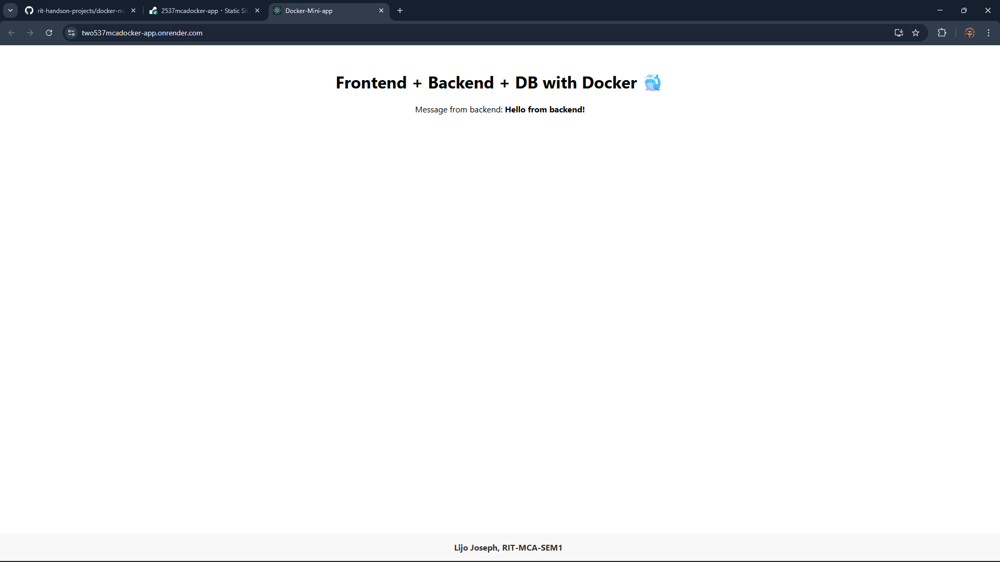
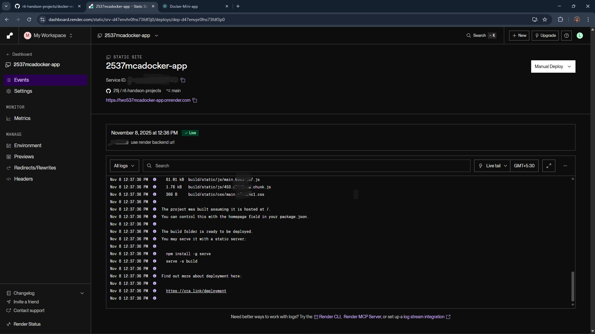

---

# 🐳 Docker Mini Full-Stack Project

A simple **full-stack web app** (React + Node.js + MongoDB) containerized using **Docker** and deployed with **Render**.
The app demonstrates how a frontend, backend, and database can communicate across containers seamlessly. Just for *learning purpose*.

---

## 🚀 Features

* React frontend served via Nginx
* Express.js + MongoDB backend API
* MongoDB Atlas cloud database
* Dockerized microservices architecture
* Deployment on Render (backend + frontend separately)

---

## 🗂️ Project Structure

```
docker-mini-app/
├── frontend/           # React app
│   ├── src/
│   ├── public/
│   └── Dockerfile
│
├── backend/            # Node.js + Express + Mongoose API
│   ├── server.js
│   ├── package.json
│   ├── .env            # contains MONGO_URL (not pushed to GitHub)
│   └── Dockerfile
│
└── docker-compose.yml  # combines all 3 services (frontend, backend, mongo)
```

---

## ⚙️ Tech Stack

| Layer            | Technology             |
| :--------------- | :--------------------- |
| Frontend         | React, Nginx           |
| Backend          | Node.js, Express.js    |
| Database         | MongoDB (Atlas)        |
| Containerization | Docker, Docker Compose |
| Deployment       | Render                 |

---

## 🧰 Setup Instructions

### 1️⃣ Clone the repository

```bash
git clone https://github.com/<your-username>/docker-mini-app.git
cd docker-mini-app
```

### 2️⃣ Start the project locally with Docker

```bash
docker-compose up --build
```

Then open:
👉 **[http://localhost:3000](http://localhost:3000)**

You should see the frontend displaying:

```
Frontend + Backend + DB with Docker 🐳
Message from backend: Hello from backend!
```

---

## 🌐 Deploying to Render

### Backend (API)

1. Push your code to GitHub.
2. Go to [Render Dashboard](https://dashboard.render.com) → **New → Web Service**.
3. Select your repo → configure:

   * **Root Directory:** `backend`
   * **Build Command:** `npm install`
   * **Start Command:** `node server.js`
4. Add environment variable:

   ```
   MONGO_URL = mongodb+srv://<user>:<password>@urcluster0.xyz.mongodb.net/dockerlearn
   ```
5. Deploy → note your backend URL (e.g. `https://docker-mini-backend.onrender.com`).

### Frontend (React)

1. On Render → **New → Static Site**.
2. Select same repo → configure:

   * **Root Directory:** `frontend`
   * **Build Command:** `npm install && npm run build`
   * **Publish Directory:** `build`
3. In `frontend/src/App.js`, update fetch URL:

   ```js
   fetch("https://docker-mini-backend.onrender.com/api/hello")
   ```
4. Commit + push → deploy frontend.
5. Visit your frontend live URL (e.g. `https://docker-mini-frontend.onrender.com`).

---

## 🖼️ Screenshots

### 🧩 Application Interface




### 📊 Render Monitoring Dashboard



---

## 🌍 Live

[Click Here](https://two537mcadocker-app.onrender.com/)

---

## 🔒 Environment Variables

| Variable    | Description                     |
| ----------- | ------------------------------- |
| `MONGO_URL` | MongoDB Atlas connection string |

> ⚠️ Add `.env` to `.gitignore` to prevent secrets from being pushed to GitHub.

---

## 🧪 Testing Locally (Optional)

```bash
# Run backend only
cd backend
node server.js

# Or start React app only
cd frontend
npm start
```

---

## 💡 Learning Outcomes

* Understand how to containerize frontend, backend, and DB.
* Learn Docker networking between services.
* Practice deploying Node + React apps on Render.
* Secure environment variables using `.env` and Render secrets.

---

## 👨‍💻 Author

**Lijo**

🔗 [GitHub Profile](https://github.com/21lj)

---

